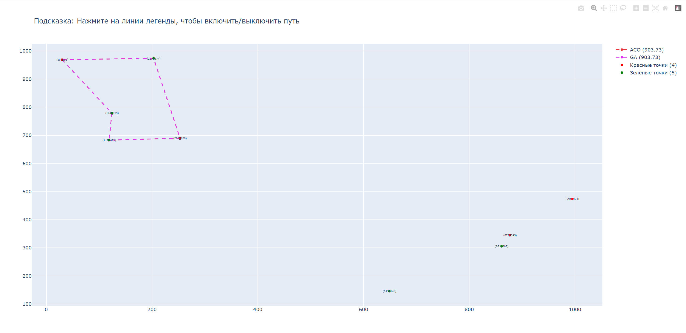

# Коммивояжер с ограничениями 🚀

## Описание 📖

Программа для решения усложнённой задачи коммивояжера, где необходимо посетить `n` из `N` городов первого типа и `m` из `M` городов второго типа. Решение задачи осуществляется с использованием генетического и муравьиного алгоритмов, а результаты визуализируются с помощью Plotly.

## Функциональность 🔍

- **Генетический алгоритм**: Используется для поиска оптимального решения.
- **Муравьиный алгоритм**: Предназначен для поиска оптимального решения, основываясь на поведении муравьёв.
- **Визуализация маршрута**: Маршрут коммивояжера визуализируется с использованием Plotly, что позволяет наглядно оценить решение задачи.
- **Настройка параметров**: Возможность гибкой настройки параметров алгоритмов для повышения эффективности решения.

## Установка и запуск 🚀

1. **Клонируйте репозиторий**:

    ```bash
    git clone https://github.com/LuckyAm20/Traveling_salesman_task.git
    cd Traveling_salesman_task
    ```

2. **Сборка и запуск Docker контейнеров**:

    ```bash
    pip install -r requirements.txt
    ```

3. **Запустите решение задачи**:

    ```bash
    python main.py
    ```
   или
   ```bash
    python main.py -n 2 -m 3 -N 4 -M 5
    ```

## Скриншоты выполнения 📸




## Используемые технологии 🛠️

- Python
- Генетический алгоритм
- Муравьиный алгоритм
- Plotly
- Docker и Docker Compose

## © Лицензия

Этот проект распространяется под лицензией MIT. Подробнее см. файл [LICENSE](LICENSE).

## 👨‍💻 Автор

- [Aptukov Mikhail - github](https://github.com/LuckyAm20)
